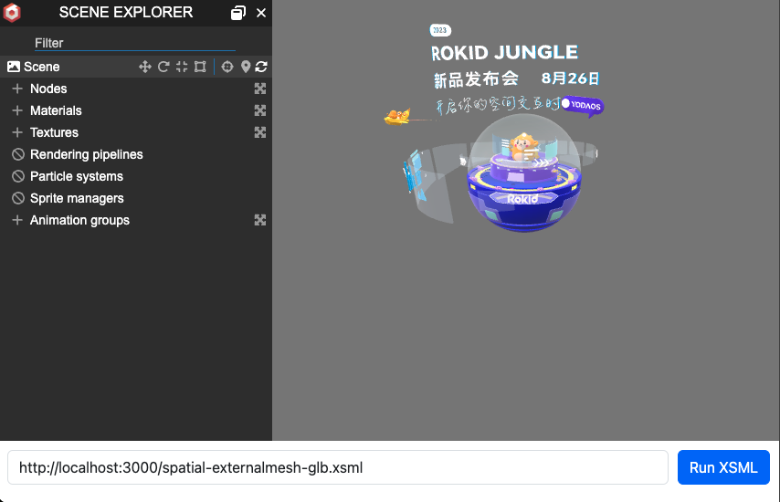

# JSAR-DOM

[](https://badge.fury.io/js/@yodaos-jsar%2Fdom)
[](https://github.com/M-CreativeLab/jsar-dom/actions/workflows/build.yml)
[](https://github.com/M-CreativeLab/jsar-dom/actions/workflows/integration-tests-build.yml)

This project JSAR-DOM is a [TypeScript][] implementation of many Web standards, notably the WHATWG [DOM][], [CSSOM][], [WebXR][] and XSML, for use in Node.js and browser.

This project is a part of the [JSAR][], which is a Web-compatible runtime for integrating XR applications (especially Interactive Digtal Product) into native environments like Unity.

> JSAR-DOM is a fork of [jsdom/jsdom][] project and its children projects with a [TypeScript][] rewrite and added the support for XSML and SCSS.

> **Interactive Digital Product (IDP)** represents a virtual entity designed to digitally replicate and interactively showcase real-world products in metaverse. This representation emphasizes the digital nature of the item, allowing users to engage with it in an interactive manner. IDPs serve as dynamic and immersive digital counterparts to physical products, offering a novel and engaging user experience within a virtual environment.

## Features

- **Web-standards APIs** notably including WHATWG [DOM][], [CSSOM][], [WebXR][] and XSML.
- **ECMAScript Modules** with [TypeScript][], [WebAssembly][] and non-script assets supports.
- **No Build At All** to get started for application developers.

## Getting Started

JSAR-DOM is designed to be a drop-in and easy-to-use replacement for the `jsdom` package. After installing it, you just need to change your `require` or `import` call from `jsdom` to `@yodaos-jsar/dom`:

```js
import { JSARDOM } from '@yodaos-jsar/dom';
// or
const { JSARDOM } = require('@yodaos-jsar/dom');
```

Then you can use it exactly as you would use `jsdom`:

```js
const dom = new JSARDOM(`
<xsml>
  <head>
    <title>Hello JSAR</title>
    <script>
      document.querySelector('sphere').style.scaling = [1.2, 1.2, 1.2];
    </script>
  </head>
  <space>
    <sphere />
  </space>
</xsml>
`, {
  url: 'https://example.com',
  nativeDocument: yourNativeDocument,
});

await dom.load();
```

Because JSAR-DOM is not going to be a emulator of the traditional browser, it's an in-production implementation of the WHATWG [DOM][], [CSSOM][], [WebXR][] and XSML for XR applications, so an instance of implementing the `NativeDocument` interface must be pass to the constructor, which implemented the underlying stuffs like rendering and event handling.

### Using headless `NativeDocument` implementation

If you want to use JSAR-DOM in a headless environment, you can use the `HeadlessNativeDocument` implementation, which is a headless implementation of the `NativeDocument` interface.

```sh
$ ts-node src/impl-headless.ts ./fixtures/simple.xsml
```

At JSAR-DOM project, we use the this implementation for tests purpose, you could also use it to see how to write a `NativeDocument` implementation, or just run a XSML application in a headless environment.

### Using Babylon.js `NativeDocument` implementation

Inside the JSAR-DOM project, we also provide a Babylon.js implementation of the `NativeDocument` interface, which is an implementation of the `NativeDocument` interface based on the [Babylon.js](https://www.babylonjs.com/) engine on classic Web browsers.

To use it, you need the following instructions:

```sh
$ cd pages
$ npm install
$ npx webpack
open ./index.html
```



Then you could type a HTTP or HTTPS URL of a XSML to view in the browser.

> Babylon.js Implementation is a good example of how to integrate JSAR-DOM applications into a classic Web ecosystem, see [./pages/impl-babylonjs.ts](./pages/impl-babylonjs.ts) for the full source code.

## Installation

```sh
npm install @yodaos-jsar/dom
```

## What's XSML?

XSML: eXtensible Spatial Markup Language.

It is a XML-based markup language for describing XR applications. It's designed to be a subset of HTML, and it's also a part of the JSAR project.

> **Why not X3D**
>
> [X3D][] is a great standard for describing 3D scenes after [VRML][], but it's not designed for Web developers and not extending the HTML standard, XSML is designed to be a subset of HTML and it's easy to learn for Web developers.

An example of XSML:

```xml
<xsml>
  <head>
    <title>Hello JSAR-DOM</title>
  </head>
  <space>
    <sphere />
  </space>
</xsml>
```

## What's SCSS?

SCSS: Spatial Cascading Style Sheets.

It's a CSS-like language for styling XSML elements, it's designed to be a part of new CSS standard and compatible with the CSS3 standard. SCSS added some new features for styling spatial elements, like `rotation`, `position`, `scaling`, materials and textures.

An example of SCSS:

```css
@material litered {
  diffuse-color: red;
}

sphere {
  scaling: 1.2 1.2 1;
  material: "litered"
}
```

## License

See [Apache-2.0](./LICENSE).

[jsdom/jsdom]: https://github.com/jsdom/jsdom
[DOM]: https://dom.spec.whatwg.org/
[CSSOM]: https://drafts.csswg.org/cssom/
[WebXR]: https://www.w3.org/TR/webxr/
[JSAR]: https://jsar.netlify.app/
[X3D]: https://en.wikipedia.org/wiki/X3D
[VRML]: https://en.wikipedia.org/wiki/VRML
[TypeScript]: https://www.typescriptlang.org/
[WebAssembly]: https://webassembly.org/
